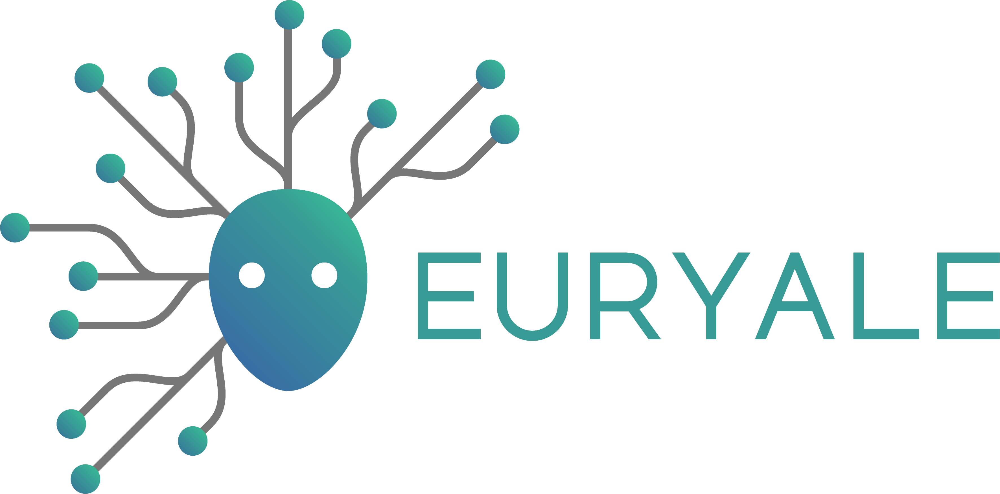
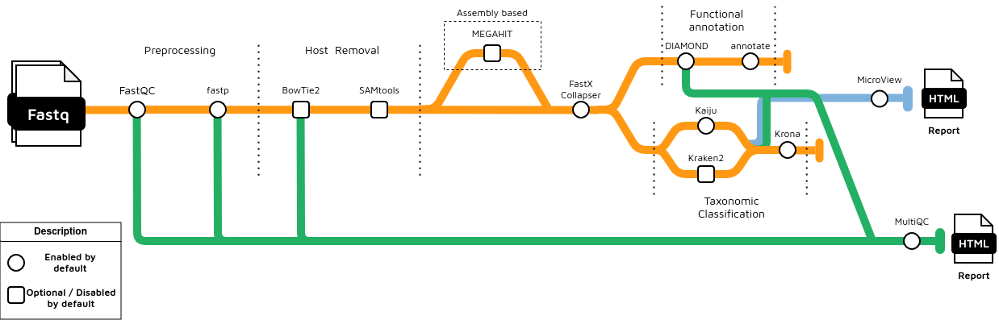

[](https://github.com/dalmolingroup/euryale/actions/workflows/ci.yml)
[](https://github.com/dalmolingroup/euryale/actions/workflows/docs.yml)

[](https://www.nextflow.io/)
[](https://www.docker.com/)
[](https://sylabs.io/docs/)



## Introduction

**dalmolingroup/euryale** is a pipeline for taxonomic classification and functional annotation of metagenomic reads. Based on [MEDUSA](https://github.com/dalmolingroup/medusa).

The pipeline is built using [Nextflow](https://www.nextflow.io), a workflow tool to run tasks across multiple compute infrastructures in a very portable manner. It uses Docker/Singularity containers making installation trivial and results highly reproducible. The [Nextflow DSL2](https://www.nextflow.io/docs/latest/dsl2.html) implementation of this pipeline uses one container per process which makes it much easier to maintain and update software dependencies. Where possible, these processes have been submitted to and installed from [nf-core/modules](https://github.com/nf-core/modules) in order to make them available to all nf-core pipelines, and to everyone within the Nextflow community!

## Pipeline summary

<picture>

  <source media="(prefers-color-scheme: dark)" srcset="./assets/euryale_workflow.drawio.png">
  
</picture>

### Pre-processing

- Read QC ([`FastQC`](https://www.bioinformatics.babraham.ac.uk/projects/fastqc/))
- Read trimming and merging ([`fastp`](https://github.com/OpenGene/fastp))
- (_optionally_) Host read removal ([`BowTie2`](https://bowtie-bio.sourceforge.net/bowtie2/manual.shtml))
- Duplicated sequence removal ([`fastx collapser`](http://hannonlab.cshl.edu/fastx_toolkit/))
- Present QC and other data ([`MultiQC`](http://multiqc.info/))

### Assembly

- (_optionally_) Read assembly ([`MEGAHIT`](https://github.com/voutcn/megahit))

### Taxonomic classification

- Sequence classification ([`Kaiju`](https://github.com/bioinformatics-centre/kaiju/))
- Sequence classification ([`Kraken2`](https://github.com/DerrickWood/kraken2))
- Visualization ([`Krona`](https://github.com/marbl/Krona/wiki))

### Functional annotation

- Sequence alignment ([`DIAMOND`](https://github.com/bbuchfink/diamond))
- Map alignment matches to functional database ([`annotate`](https://github.com/dalmolingroup/annotate))

## Quick Start

1. Install [`Nextflow`](https://www.nextflow.io/docs/latest/getstarted.html#installation) (`>=22.10.1`)

2. Install any of [`Docker`](https://docs.docker.com/engine/installation/), [`Singularity`](https://www.sylabs.io/guides/3.0/user-guide/) (you can follow [this tutorial](https://singularity-tutorial.github.io/01-installation/)), [`Podman`](https://podman.io/), [`Shifter`](https://nersc.gitlab.io/development/shifter/how-to-use/) or [`Charliecloud`](https://hpc.github.io/charliecloud/) for full pipeline reproducibility _(you can use [`Conda`](https://conda.io/miniconda.html) both to install Nextflow itself and also to manage software within pipelines. Please only use it within pipelines as a last resort; see [docs](https://nf-co.re/usage/configuration#basic-configuration-profiles))_.

3. Download the pipeline and test it on a minimal dataset with a single command:

```bash
nextflow run dalmolingroup/euryale -profile test,YOURPROFILE --outdir <OUTDIR>
```

Note that some form of configuration will be needed so that Nextflow knows how to fetch the required software. This is usually done in the form of a config profile (`YOURPROFILE` in the example command above). You can chain multiple config profiles in a comma-separated string.

> - The pipeline comes with config profiles called `docker`, `singularity`, `podman`, `shifter`, `charliecloud` and `conda` which instruct the pipeline to use the named tool for software management. For example, `-profile test,docker`.
> - Please check [nf-core/configs](https://github.com/nf-core/configs#documentation) to see if a custom config file to run nf-core pipelines already exists for your Institute. If so, you can simply use `-profile <institute>` in your command. This will enable either `docker` or `singularity` and set the appropriate execution settings for your local compute environment.
> - If you are using `singularity`, please use the [`nf-core download`](https://nf-co.re/tools/#downloading-pipelines-for-offline-use) command to download images first, before running the pipeline. Setting the [`NXF_SINGULARITY_CACHEDIR` or `singularity.cacheDir`](https://www.nextflow.io/docs/latest/singularity.html?#singularity-docker-hub) Nextflow options enables you to store and re-use the images from a central location for future pipeline runs.
> - If you are using `conda`, it is highly recommended to use the [`NXF_CONDA_CACHEDIR` or `conda.cacheDir`](https://www.nextflow.io/docs/latest/conda.html) settings to store the environments in a central location for future pipeline runs.

- Start running your own analysis!

```bash
nextflow run dalmolingroup/euryale \
  --input samplesheet.csv \
  --outdir <OUTDIR> \
  --kaiju_db kaiju_reference \
  --reference_fasta diamond_fasta \
  --host_fasta host_reference_fasta \
  --id_mapping id_mapping_file \
  -profile <docker/singularity/podman/shifter/charliecloud/conda/institute>
```

## Databases and references

A question that pops up a lot is: Since Euryale requires a lot of reference parameters, where can I find these references?

One option is to execute EURYALE's download entry, which will download the necessary databases for you.
This is the recommended way to get started with the pipeline.
This uses the same sources as EURYALE's predecessor MEDUSA.

```bash
nextflow run dalmolingroup/euryale \
	--download_functional \
  --download_kaiju \
  --download_host \
  --outdir <output directory> \
  -entry download \
  -profile <docker/singularity/podman/shifter/charliecloud/conda/institute>
```
In case you download the Kraken2 database (`--download_kraken`), make sure to extract it using the following command before using
it in the pipeline:

```bash
tar -xvf kraken2_db.tar.gz
```

Below we provide a short list of places where you can find these databases.
But, of course, we're not limited to these references: Euryale should be able to process your own databases, should you want to build them yourself.

### Alignment

For the alignment you can either provide `--diamond_db` for a pre-built DIAMOND database, or you can provide `--reference_fasta`.
For reference fasta, by default Euryale expects something like [NCBI-nr](https://ftp.ncbi.nlm.nih.gov/blast/db/FASTA/), but similarly formatted reference databases should also suffice.

### Taxonomic classification

At its current version, Euryale doesn't build a reference taxonomic database, but pre-built ones are supported.

- If you're using Kaiju (the default), you can provide a reference database with `--kaiju_db` and provide a .tar.gz file like the ones provided in the [official Kaiju website](https://kaiju.binf.ku.dk/server).
  We have extensively tested Euryale with the 2021 version of the nr database and it should work as expected.
- If you're using Kraken2 (By supplying `--run_kraken2`), we expect something like the [pre-built .tar.gz databases provided by the Kraken2 developers](https://benlangmead.github.io/aws-indexes/k2) to be provided to `--kraken2_db`.

### Functional annotation

We expect an ID mapping reference to be used within annotate. Since we're already expecting by default the NCBI-nr to be used as the alignment reference, [the ID mapping data file provided by Uniprot](https://ftp.uniprot.org/pub/databases/uniprot/current_release/knowledgebase/idmapping/) should work well when provided to `--id_mapping`.

### Host reference

If you're using metagenomic reads that come from a known host's microbiome, you can also provide the host's genome FASTA to `--host_fasta` parameter in order to enable our decontamination subworkflow.
[Ensembl](https://www.ensembl.org/index.html) provides easy to download genomes that can be used for this purpose.
Alternatively, you can provide a pre-built BowTie2 database directory to the `--bowtie2_db` parameter.

## Documentation

The dalmolingroup/euryale documentation is split into the following pages:

- [Usage](usage.md)

      - An overview of how the pipeline works, how to run it and a description of all of the different command-line flags.

- [Output](output.md)

      - An overview of the different results produced by the pipeline and how to interpret them.

## Credits

dalmolingroup/euryale was originally written by João Cavalcante.

We thank the following people for their extensive assistance in the development of this pipeline:

- Diego Morais (for developing the original [MEDUSA](https://github.com/dalmolingroup/medusa) pipeline)

## Citations

> Morais DAA, Cavalcante JVF, Monteiro SS, Pasquali MAB and Dalmolin RJS (2022)
> MEDUSA: A Pipeline for Sensitive Taxonomic Classification and Flexible Functional Annotation
> of Metagenomic Shotgun Sequences.
> Front. Genet. 13:814437. doi: 10.3389/fgene.2022.814437

This pipeline uses code and infrastructure developed and maintained by the [nf-core](https://nf-co.re) community, reused here under the [MIT license](https://github.com/nf-core/tools/blob/master/LICENSE).

> **The nf-core framework for community-curated bioinformatics pipelines.**
>
> Philip Ewels, Alexander Peltzer, Sven Fillinger, Harshil Patel, Johannes Alneberg, Andreas Wilm, Maxime Ulysse Garcia, Paolo Di Tommaso & Sven Nahnsen.
>
> _Nat Biotechnol._ 2020 Feb 13. doi: [10.1038/s41587-020-0439-x](https://dx.doi.org/10.1038/s41587-020-0439-x).
