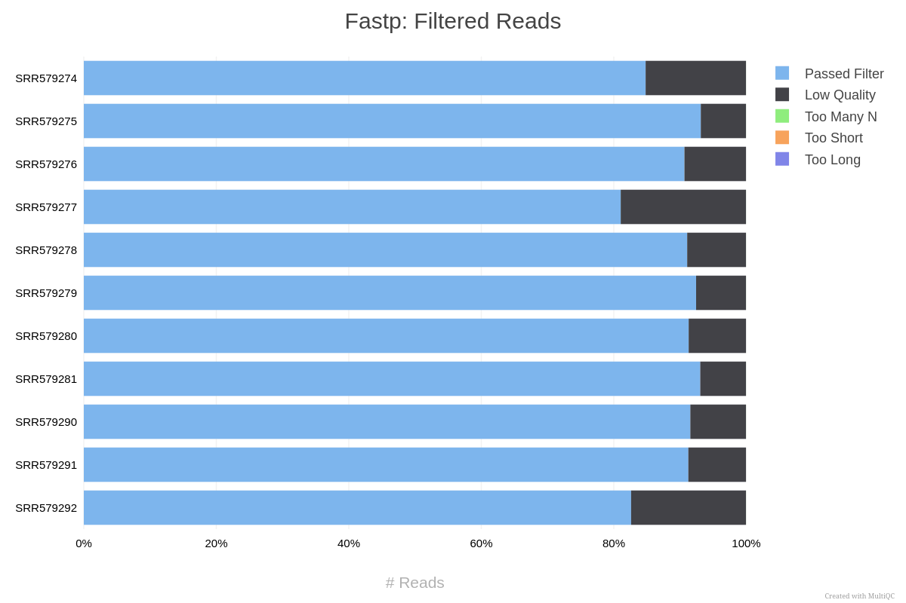
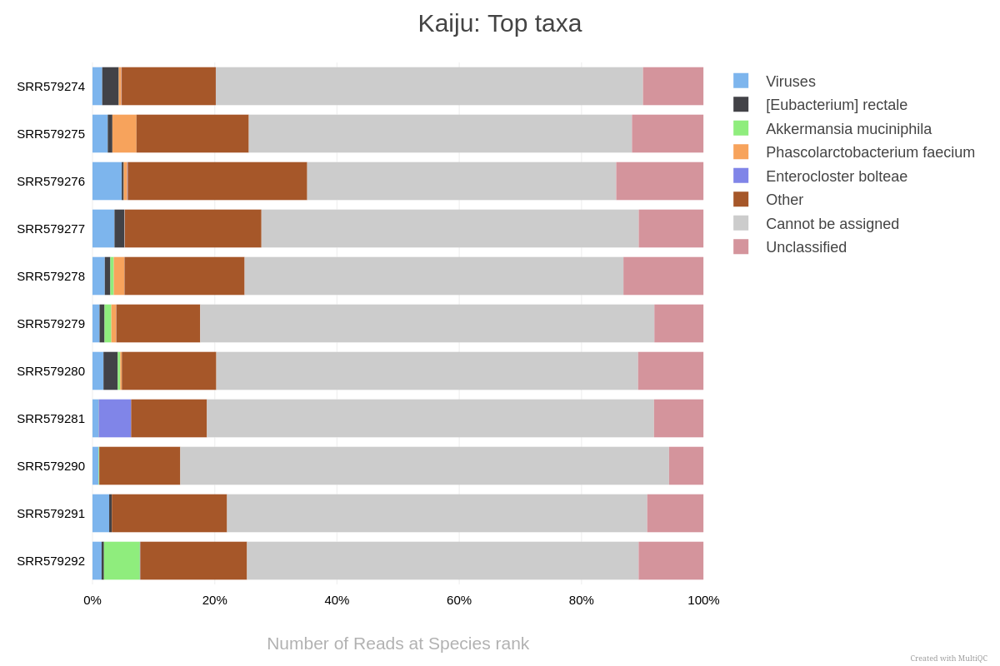
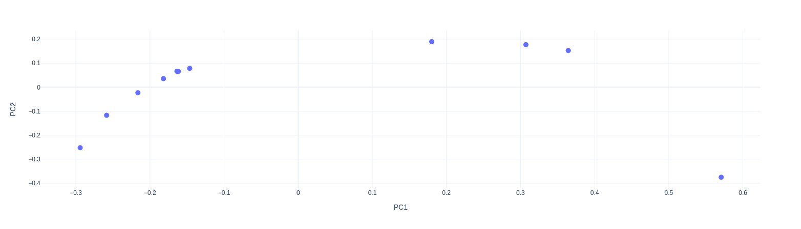

# Example analysis - Crohn's disease microbiome data

To showcase the potential EURYALE has to expedite the analysis of microbiome data, let's
try analysing a publicly available gut microbiome dataset ([PRJNA175224](https://www.ncbi.nlm.nih.gov/bioproject/PRJNA175224)).
This dataset contains 7 gut microbiome samples from healthy donors and 4 from donors with Crohn's disease.

Feel free to download the original dataset to a directory called `raw_data` and follow along.

## Acquiring databases and running the pipeline

Let's first download the databases and references.
For this analysis, we'll focus on the taxonomic classification results after de-contamination.
So, let's download the Human reference genome as well as Kaiju's database:

```bash
nextflow run dalmolingroup/euryale \
  --download_kaiju \
  --download_host \
  --outdir references \
  -entry download \
  -profile singularity
```

Once that's done, let's execute the analysis on the data itself.
Your samplesheet should look something like this:

```csv
sample,fastq_1,fastq_2
SRR579274,raw_data/SRR579274_1.fastq.gz,raw_data/SRR579274_2.fastq.gz
SRR579275,raw_data/SRR579275_1.fastq.gz,raw_data/SRR579275_2.fastq.gz
SRR579276,raw_data/SRR579276_1.fastq.gz,raw_data/SRR579276_2.fastq.gz
SRR579277,raw_data/SRR579277_1.fastq.gz,raw_data/SRR579277_2.fastq.gz
SRR579278,raw_data/SRR579278_1.fastq.gz,raw_data/SRR579278_2.fastq.gz
SRR579279,raw_data/SRR579279_1.fastq.gz,raw_data/SRR579279_2.fastq.gz
SRR579280,raw_data/SRR579280_1.fastq.gz,raw_data/SRR579280_2.fastq.gz
SRR579281,raw_data/SRR579281_1.fastq.gz,raw_data/SRR579281_2.fastq.gz
SRR579290,raw_data/SRR579290_1.fastq.gz,raw_data/SRR579290_2.fastq.gz
SRR579291,raw_data/SRR579291_1.fastq.gz,raw_data/SRR579291_2.fastq.gz
SRR579292,raw_data/SRR579292_1.fastq.gz,raw_data/SRR579292_2.fastq.gz
```

And your command should look something like this one:

```bash
nextflow run dalmolingroup/euryale \
          --input samplesheet.csv \
          --outdir results \
          --skip_alignment \
          --skip_functional \
          --kaiju_db references/kaiju_db_nr_2023-05-10.tgz \
          --host_fasta references/Homo_sapiens.GRCh38.dna.primary_assembly.fa.gz \
          -profile singularity \
          -r "v1.0.3"
```

Check the [parameter documentation](https://dalmolingroup.github.io/euryale/params/) for a full description
of possible parameters.

- We're skipping the functional annotation section just to expedite the results, but feel free to include these
  steps in your own analysis.

Once that's all done, let's check the results we got.

## Exploring the resulting data

First, let's open the MultiQC report in our browser and take a look.
It should be available in `results/multiqc/multiqc_report.html`.

We can first see that most reads (80%) in each sample passed
the quality filter, thankfully:



We can also see that most samples did not have their reads assigned
to any particular taxon:



This could be due to high host contamination, or could necessitate
the use of another database, or something else entirely! Either way, it's something worth investigating.
We can also see there is a strange spike of _Enterocloster boltae_ in one of the samples, which also
warrants further investigation.

If we now check the MicroView results, available in `results/taxonomy/microview/microview_report.html`,
we can see further points of interest to investigate in our data.

Let's see the Beta-diversity PCoA, for example:



The plot shows a somewhat strange division in the dataset: 4 samples stretch further in
the PC1 than the rest. This could be due to some biological variable or an error in the data generation process.
Either way, it's worth saving the PCoA table, available in `results/taxonomy/microview/microview_tables/` and
crossing the sample names with the metadata of this study.
